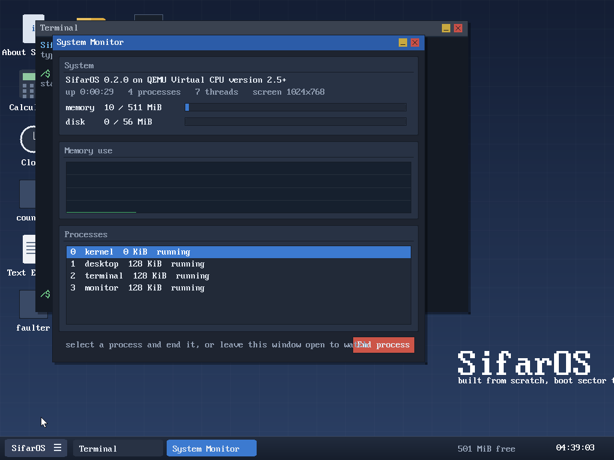
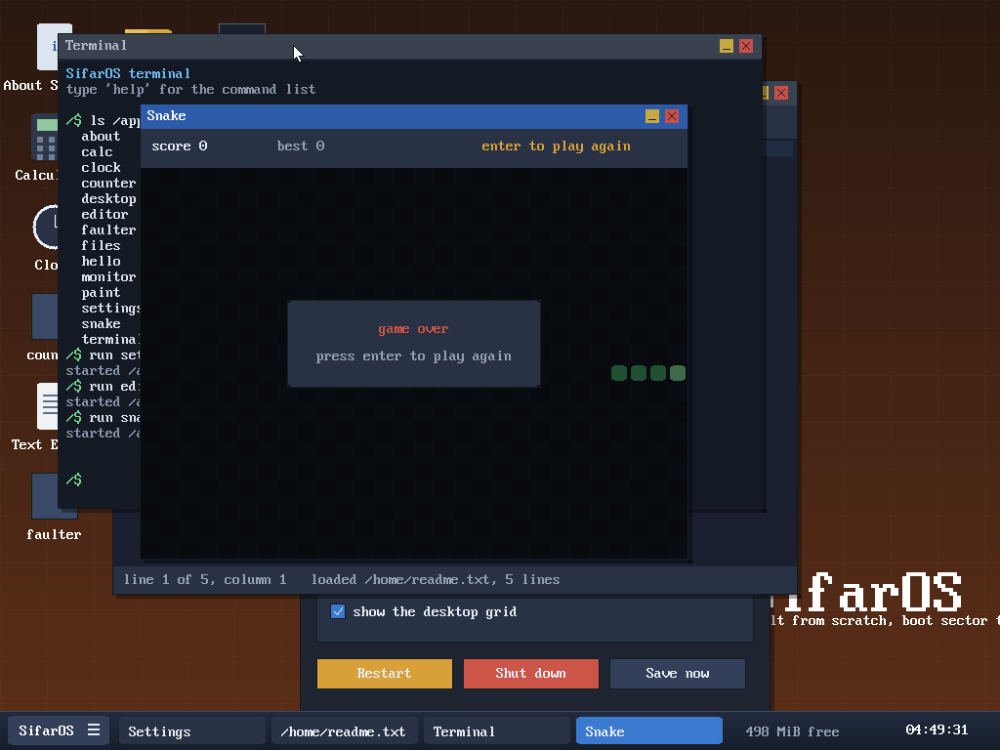

# SifarOS

An operating system for 32-bit x86, written from scratch. No Linux, no GRUB, no
C library, no existing kernel underneath. The boot sector, the loader, the
kernel, the drivers, the filesystem, the window server, the C library, the
widget toolkit and every application in these screenshots are original code in
this repository. The only thing the machine does for us is the one BIOS call
that reads the first sector off the disk.



## What it is

A machine boots into a graphical desktop. The desktop is a user-space process.
So is the terminal, the file manager, the text editor, the system monitor and
the game. Each one runs in ring 3 with its own address space and reaches the
kernel only through `int 0x80`. The kernel composites their windows, routes
the mouse and keyboard, schedules them preemptively, and keeps their files on a
real filesystem on a real disk that survives a reboot.



## What is in it

**Boot.** A 512-byte master boot record loads a second stage, which asks the
BIOS for the memory map, lifts the 8x16 font out of the video ROM, sets a
32-bit VESA framebuffer mode, opens the A20 gate, loads the kernel and enters
protected mode.

**Memory.** A bitmap allocator hands out physical frames. Paging gives every
process its own address space, with the kernel's identity map and heap window
shared into all of them through page tables allocated once at boot. The kernel
heap grows by mapping fresh frames on demand; user processes grow theirs with
`sbrk`.

**Processes and threads.** ELF executables are loaded from disk into a private
address space and started in ring 3. A round-robin scheduler preempts on the
timer interrupt, saves and restores the FPU/SSE register file per thread, and
switches page directories on the way in. A fault in a program kills that
program and nothing else.

**Storage.** An ATA PIO driver talks to the disk; SifarFS sits on top with a
superblock, a block bitmap, inodes and directories. `tools/mkfs.py` builds the
filesystem image at build time, and everything written at runtime is still
there after a reboot.

**Graphics and windows.** A software compositor draws into a back buffer and
pushes only the damaged rectangles to the card, because a full 1024x768 frame
costs about 60 ms in emulation and a repainted text line costs one. Windows are
buffers the kernel allocates and maps into the owning process; the server owns
stacking, focus, decorations, dragging, resizing and the cursor.

**Applications.** `libsifar` provides system calls, a heap, strings and
formatting; the toolkit on top gives windows, buttons, text fields, lists,
panels and an immediate-mode redraw loop. The applications are ordinary ELF
binaries in `/apps`.

| | |
|---|---|
| Terminal | a shell with 20+ commands, history and scrollback |
| Files | browse, open, create folders, delete |
| Text Editor | load, edit and save files that persist |
| System Monitor | live memory, disk and process figures with a history graph |
| Settings | desktop themes, written to a file the desktop watches |
| Calculator | mouse or keyboard, floating point |
| Clock | analogue face from the hardware clock |
| Paint | brushes, palette, a canvas |
| Snake | arrows or WASD |
| About | what the system is made of |

## Building and running

Requirements: `gcc` with 32-bit support (`gcc-multilib`), `binutils`, `nasm`,
`make`, `python3` and `qemu-system-i386`.

```sh
make            # build build/sifaros.img
make run        # boot it
make test       # boot it and run the serial test suite
make test-gui   # boot it, drive the desktop with mouse and keyboard, check the frames
make shot       # boot it and save a screenshot
make debug      # boot it stopped, waiting for gdb on localhost:1234
```

The image is a plain raw disk: it also boots on real hardware written to a USB
stick with `dd`, given a BIOS or CSM.

## Using it

Double click an icon, or open the launcher in the bottom left. Windows drag by
their title bar, resize from the bottom right corner, minimise and close from
the buttons on the right. The taskbar switches between them.

In the terminal: `help` lists the commands, `run <app>` starts an application,
`ls`, `cat`, `write`, `mkdir`, `rm` and `cp` work on the disk, `ps` and `mem`
show what the system is doing, `dmesg` prints the boot log.

There is also a kernel debug console on the serial line the whole time, with
its own shell: `selftest` runs 132 in-kernel checks, `windows` lists the window
server's state, `bench` times the graphics paths, `procs` lists processes.

## Testing

```
make test       44 checks: boot, filesystem, processes, fault isolation,
                the in-kernel suite, and a reboot to prove writes persisted
make test-gui   15 checks: drives the desktop through QEMU's mouse and
                keyboard and inspects the resulting frames
```

Both run against a real boot in QEMU. There is no mocking anywhere.

## Layout

```
boot/          stage 1 boot sector, stage 2 loader (memory map, VESA, protected mode)
kernel/
  arch/x86/    GDT, TSS, IDT, ISRs, faults, PIC, PIT, FPU, CPUID, context switch
  dev/         VESA console, serial, PS/2 keyboard and mouse, ATA, RTC
  mm/          frame allocator, paging and address spaces, kernel heap
  fs/          VFS, ramfs, SifarFS
  gfx/         drawing primitives, clipping, text
  gui/         window server and compositor
  sh/          the serial debug shell
  proc.c       processes; elf.c: loader; sched.c: scheduler; syscall.c: the ABI
  ktest.c      132 in-kernel tests
user/
  lib/         libsifar and the widget toolkit
  apps/        the applications
tools/         build, run, screenshot and test scripts, mkfs
docs/          architecture and build notes
```

`docs/ARCHITECTURE.md` explains how the pieces fit together.

## Limits

32-bit x86 only. One disk, no partitions beyond the fixed layout. No network,
no sound, no SMP, no swap, no dynamic linking. Windows are composited in
software. These are the next things to build, not accidents.
