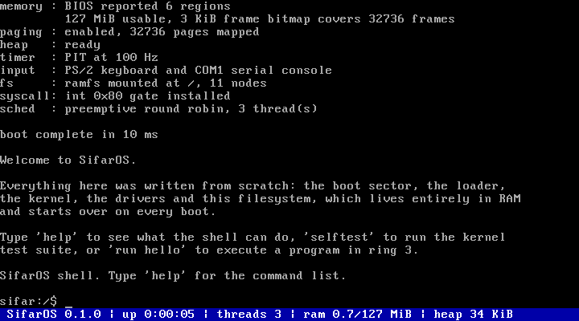

# SifarOS

A 32-bit operating system for x86, written from scratch. No Linux, no GRUB, no
C library, no existing kernel underneath it. The boot sector, the loader, the
kernel, the drivers, the memory manager, the scheduler, the filesystem, the
shell and the user programs in this repository are all original code, and the
only thing the machine does for us is the BIOS call that reads the first sector
off the disk.



```
sifar:/$ uname
SifarOS 0.1.0 i386
cpu: QEMU Virtual CPU version 2.5+ (GenuineIntel)

sifar:/$ run hello
hello: running in ring 3 as thread 6
hello: sum of 1..1000 = 500500 (computed in user space)
hello: read back /home/hello.txt -> written from ring 3 by hello
[hello exited with status 7]
```

## What it does

**Boots itself.** A 512-byte master boot record loads a second stage, which
asks the BIOS for the memory map, opens the A20 gate, reads the kernel off the
disk, installs a GDT and switches the processor into 32-bit protected mode.

**Manages memory.** A bitmap allocator hands out 4 KiB physical frames based on
what the BIOS reported. Paging is enabled with every frame of RAM identity
mapped, and the kernel heap lives in its own virtual region that grows by
mapping fresh frames on demand.

**Runs threads.** A round-robin scheduler preempts on the timer interrupt.
Threads sleep, yield, exit with a status and can be joined or killed. Context
switching is a hand-written assembly routine that swaps kernel stacks.

**Has a filesystem.** A VFS layer owns the directory tree and all path handling
(including `.`, `..` and relative paths); a ramfs backend stores file contents
in heap buffers that grow as they are written.

**Enforces privilege.** User programs are flat binaries built separately from
the kernel, embedded into the kernel image, then loaded into pages marked
user-accessible and started in ring 3. They reach the kernel only through
`int 0x80`, and every pointer they pass is checked. A program that touches
kernel memory is killed while the rest of the system keeps running.

**Talks to hardware.** VGA text mode with a status bar, a 16550 UART, the 8259
interrupt controllers, the 8254 timer, a PS/2 keyboard with modifier handling,
and the CMOS real time clock.

**Tests itself.** 84 assertions run inside the booted kernel covering strings,
formatting, 64-bit division, the frame allocator, paging, the heap, the
filesystem, the scheduler and interrupt delivery. `tools/test.sh` boots the
image under QEMU, drives the shell over the serial line and checks 44
end-to-end expectations on top of that.

## Building and running

Requirements: `gcc` with 32-bit support (`gcc-multilib`), `binutils`, `nasm`,
`make` and `qemu-system-i386`.

```sh
make            # build build/sifaros.img
make run        # boot it (graphical window, or serial if there is no display)
make run-serial # boot it headless with the console on this terminal
make test       # boot it and run the full automated test suite
make debug      # boot it stopped, waiting for gdb on localhost:1234
```

The image is a plain raw disk, so it also boots on real hardware written to a
USB stick with `dd`, and under any other emulator.

Quit QEMU with `Ctrl-A` then `X`.

## Using it

The shell reads from the PS/2 keyboard and the serial line at the same time, so
everything below works in either. Arrow keys move the cursor and walk the
command history, `^C` cancels a line, `^L` clears the screen.

| | |
|---|---|
| `help`, `uname`, `uptime`, `date` | system information |
| `mem`, `heap`, `ps`, `kill`, `spawn` | memory and threads |
| `ls`, `tree`, `cd`, `pwd`, `stat` | moving around the filesystem |
| `cat`, `write`, `append`, `cp`, `rm`, `mkdir`, `touch`, `hexdump` | files |
| `programs`, `run` | ring 3 programs |
| `selftest` | the in-kernel test suite |
| `reboot`, `halt` | leaving |

Try `spawn 4` and then `ps` to watch preemption, or `run faulter` to watch the
kernel kill a program that reaches for memory it does not own.

## Layout

```
boot/        stage 1 boot sector and stage 2 protected mode loader
kernel/
  arch/x86/  GDT, TSS, IDT, interrupt stubs, faults, PIC, PIT, CPUID, switching
  dev/       VGA, serial, keyboard, RTC, console multiplexer
  mm/        physical frame allocator, paging, kernel heap
  fs/        VFS and the ramfs backend
  sh/        the shell
  lib/       strings, printf, 64-bit division
  main.c     bring-up order
  sched.c    the scheduler
  syscall.c  the int 0x80 interface
  proc.c     loading user programs
  ktest.c    the in-kernel test suite
user/        the ring 3 programs and their tiny runtime library
include/     kernel and shared headers
tools/       build, run and test scripts
docs/        how it fits together
```

`docs/ARCHITECTURE.md` walks through the boot sequence, the memory map and each
subsystem in more detail.

## Limits

It is honest about what it is: a single address space shared by every thread,
one user program resident at a time, a filesystem that lives in RAM and starts
over on every boot, no disk driver, no networking, no SMP, and 32-bit x86 only.
Those are the next things to build, not accidents.
