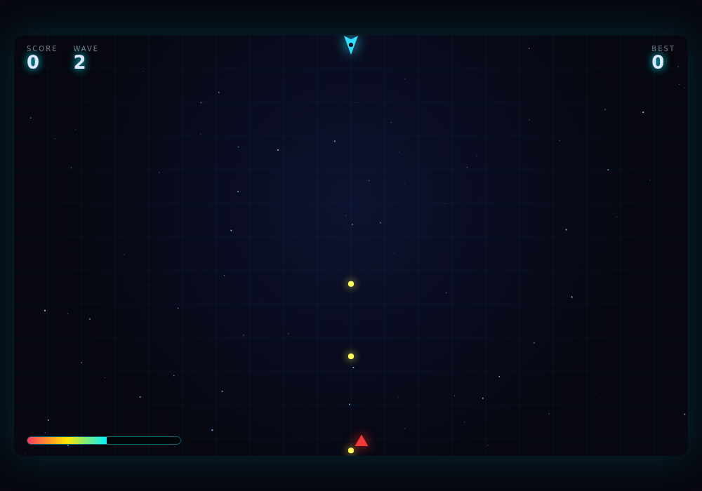

# NEON DRIFT

A neon twin-stick arena shooter that runs entirely in the browser — no build
step, no dependencies, no assets. Just open it and play. Survive endless waves
of geometric enemies, and pick a roguelite upgrade after every wave.



## Play

Because it uses ES modules, it must be served over HTTP (not opened as a
`file://` URL):

```bash
cd game
python3 -m http.server 8099
# then open http://localhost:8099
```

Any static server works (`npx serve`, `php -S`, etc.).

## Controls

| Action | Keys |
| ------ | ---- |
| Move   | `W` `A` `S` `D` or arrow keys |
| Aim    | Mouse |
| Fire   | Left click or `Space` (hold) |
| Dash   | `Shift` — short burst with brief invulnerability |
| Pause  | `P` |

Touch is supported too: touch-and-drag to aim and fire.

## How it plays

- **Waves.** Each wave spawns more, faster, tougher enemies. Clear them all to
  advance.
- **Enemies.**
  - 🔺 **Grunt** — fast and fragile, charges straight at you.
  - ⬡ **Brute** — slow tank with a heavy hit (wave 3+).
  - ◆ **Weaver** — serpentine, hard to pin down (wave 2+).
- **Upgrades.** After every wave, choose 1 of 3: rapid fire, high caliber,
  split shot, piercing rounds, overdrive, extra HP, and more. Builds stack, so
  each run drifts toward a different playstyle.
- **Best score** is saved to `localStorage`.

## Architecture

Plain ES modules, one responsibility each — no framework:

```
game/
├── index.html          markup + overlays (title / upgrade / game-over / pause)
├── css/style.css       neon styling, HUD, responsive stage
└── js/
    ├── main.js         entry point — wires everything together
    ├── game.js         the loop: state machine, waves, collisions, rendering
    ├── player.js       ship movement, dash, firing
    ├── enemy.js        enemy types + wave-scaled spawn table
    ├── bullet.js       projectiles with piercing
    ├── particles.js    explosions, sparks, thruster trails
    ├── upgrades.js     roguelite upgrade pool
    ├── input.js        keyboard + mouse + touch state
    ├── audio.js        WebAudio synthesised SFX (zero audio files)
    ├── ui.js           DOM overlay / HUD controller
    └── utils.js        shared math helpers
```

All sound is synthesised at runtime with the WebAudio API and all graphics are
drawn on a `<canvas>`, so the whole game is just text files.
